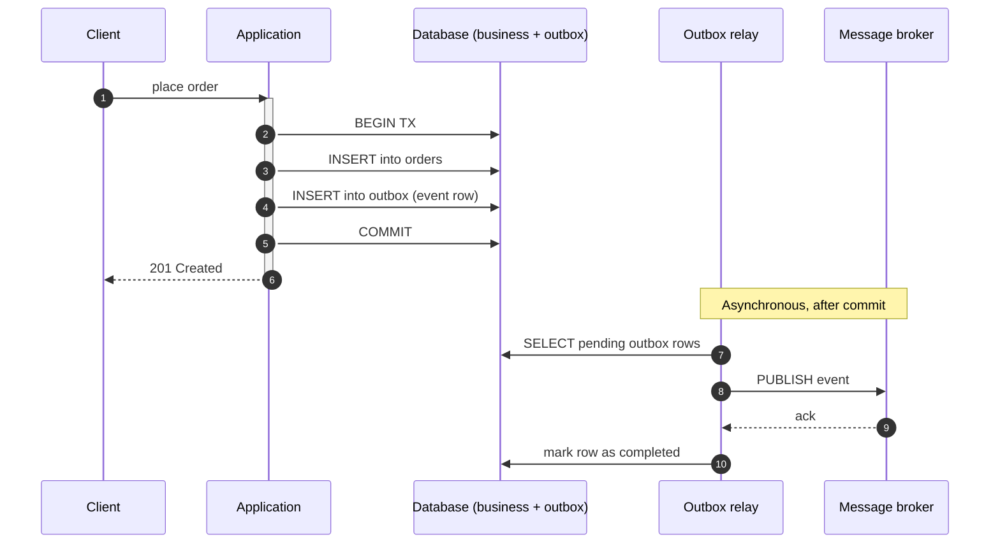
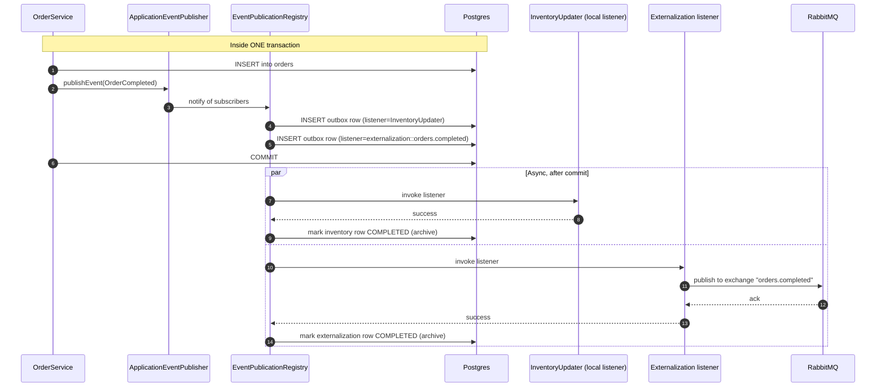
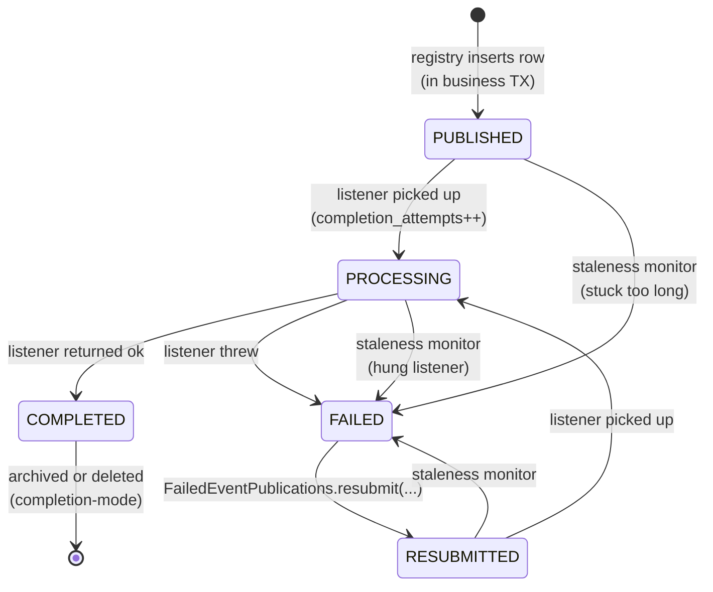
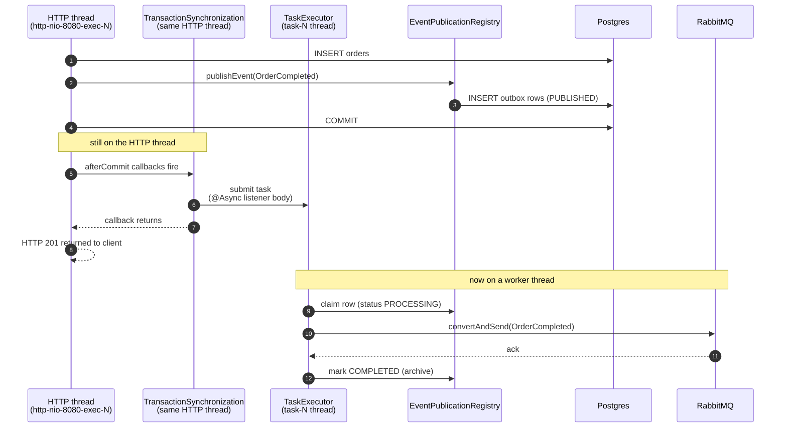
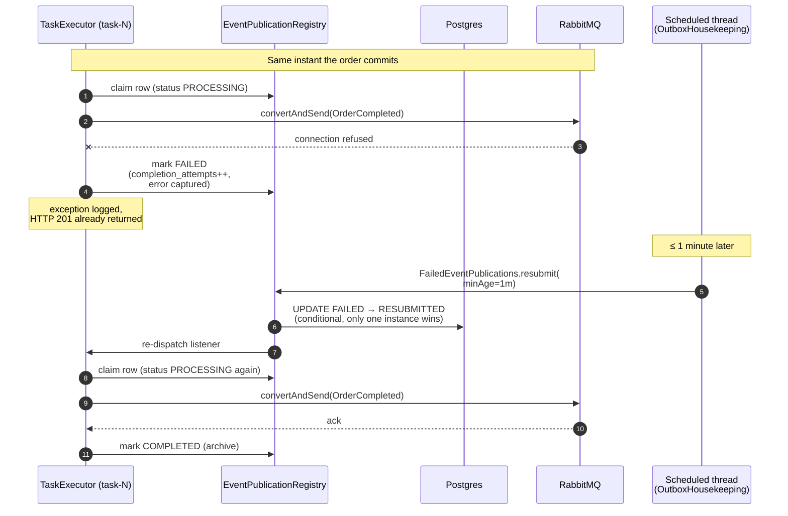
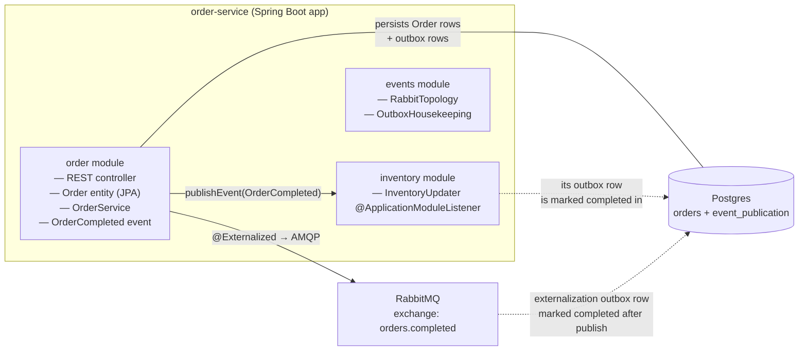

# Spring Modulith Outbox

A concrete walkthrough of the transactional outbox pattern as implemented by Spring Modulith
2.0, illustrated against this repository.

## 1. Why the outbox pattern exists

A typical "do work, then publish a message" service looks like:

```java
@Transactional
public void place(...) {
    orderRepo.save(order);                      // (1) database write
    rabbitTemplate.convertAndSend("orders", ev); // (2) broker write
}
```

This is a **dual write** — two independent systems updated in one logical operation. There is no
distributed transaction protecting them, so any of these can happen:

- (1) commits, (2) fails → the order exists, but the broker never hears about it. Downstream
  services (inventory, billing, fulfilment) silently fall out of sync.
- (1) is rolled back after (2) was sent → the broker carries an event for an order that does not
  exist.
- The process crashes between (1) and (2).

The **transactional outbox pattern** fixes this by writing the message into the same database,
in the same transaction, as the business state change. A separate process then reads from that
"outbox" table and forwards messages to the broker, marking them as sent. Either the business
write *and* the outbox row commit together, or neither does. There is no inconsistency window.



## 2. Spring Modulith's implementation

Spring Modulith does not call this "outbox", it calls it the **Event Publication Registry**. The
mechanics are exactly the outbox pattern, with the relay built into the same JVM as the
application.

The moving pieces:

- `EventPublicationRegistry` — internal SPI that writes a row to the outbox when a Spring
  `ApplicationEvent` is published, and marks it complete after the listener finishes.
- `EventPublicationRepository` — pluggable storage. This project uses the JDBC adapter
  (`spring-modulith-events-jdbc`); JPA, MongoDB, and Neo4j adapters also exist.
- `EventSerializer` — pluggable serialization of the event payload. Default is Jackson JSON.
- `@ApplicationModuleListener` — the recommended way to subscribe. Wraps `@Async`,
  `@TransactionalEventListener(AFTER_COMMIT)`, and `@Transactional(REQUIRES_NEW)` so each
  listener runs after the publishing transaction commits, in its own new transaction, on a
  separate thread.
- `@Externalized` — marks an event type for forwarding to an external broker. Spring Modulith
  registers a synthetic listener that does the broker publish, and that synthetic listener is
  itself tracked by the outbox.

### 2.1 What happens when an event is published



The two key invariants:

- The outbox INSERTs are part of the business transaction. If the transaction rolls back, no
  outbox rows exist; nothing leaks downstream.
- Each subscriber gets its **own** row. They succeed and fail independently. A broker outage
  does not block the inventory listener; an inventory bug does not block the broker publish.

### 2.2 Publication lifecycle (Spring Modulith 2.0)



Each row tracks `status`, `completion_attempts`, `last_resubmission_date`, plus the original
publication date and serialized event. The staleness monitor is a scheduled task (default off,
enabled by setting any of the three staleness durations) that flips rows stuck in `PUBLISHED`,
`PROCESSING`, or `RESUBMITTED` to `FAILED` so they can be resubmitted. **Spring Modulith does
not retry failed listeners on its own** — your application code calls
`FailedEventPublications.resubmit(...)` on a schedule (this project does, in `OutboxHousekeeping`).

### 2.3 Completion modes

The `spring.modulith.events.completion-mode` property decides what happens to a row after the
listener succeeds:

| Mode      | Effect                                                                                               | Trade-off                                                |
|-----------|------------------------------------------------------------------------------------------------------|----------------------------------------------------------|
| `update`  | Set `completion_date` on the existing row.                                                           | Active outbox table grows unbounded; needs periodic purge|
| `delete`  | Delete the row.                                                                                      | No audit trail of what was published                     |
| `archive` | Move the row to `event_publication_archive` (same schema), with `completion_date` set.               | Audit trail preserved, active table stays small          |

This project uses `archive` and a scheduled job purges the archive after 7 days.

### 2.4 Externalization to a broker

Externalization is a synthetic listener provided by `spring-modulith-events-amqp`/`-kafka`/`-jms`
modules. It looks for events annotated with `@Externalized` and publishes them. The annotation
value uses a `target::routingKey` syntax with SpEL:

```java
@Externalized("orders.completed::#{#this.orderId()}")
public record OrderCompleted(...) { }
```

For AMQP, `target` is the exchange name and `routingKey` is the AMQP routing key. Spring
Modulith publishes via `RabbitTemplate`; a `Jackson2JsonMessageConverter` bean (from
`RabbitTopology` in this project) makes it serialize the event as JSON.

Crucially, the externalization listener is **just another subscriber** as far as the outbox is
concerned. Its outbox row is only marked completed after the broker has acknowledged the
message. If RabbitMQ is unreachable, the row stays `FAILED` and is resubmitted by
`OutboxHousekeeping`.

### 2.5 Dispatch model: not a polling outbox

The classical outbox pattern uses a separate poller that scans the outbox table on a timer
and pushes rows to the broker. Spring Modulith does **not** do that. The dispatcher is a
Spring transaction-synchronization callback that fires the moment the publishing transaction
commits. There is no scheduled task in the happy path.

#### Threads involved in a single `POST /orders`



Two key facts from this picture:

- **The HTTP thread does not wait for Rabbit.** Once the database commits, the listener is
  scheduled on the executor and the HTTP response goes out. Total latency for the client is
  business commit + a few microseconds of synchronization machinery.
- **`@Async` ≠ scheduled.** The annotation just routes the listener body to a `TaskExecutor`
  thread. The decision to invoke is still made synchronously at commit time. There is no
  timer waking up periodically to look for new rows.

#### What happens when the broker call fails



And the **stuck-listener** case — the JVM died between `PROCESSING` and the row update:

```mermaid
sequenceDiagram
    autonumber
    participant ExecOld as task-N (instance A)
    participant Reg as EventPublicationRegistry
    participant Stale as Staleness monitor<br/>(scheduled, every 30s)
    participant Sched as OutboxHousekeeping<br/>(scheduled, every 1m)
    participant ExecNew as task-N (instance B)
    participant Rabbit as RabbitMQ

    ExecOld->>Reg: claim row (status PROCESSING)
    Note over ExecOld: instance A crashes
    Note over Reg: row stuck in PROCESSING

    Note over Stale: ≤ 30s later
    Stale->>Reg: scan; row PROCESSING > 1m?
    Note over Stale: not yet; wait
    Stale->>Reg: next scan; row PROCESSING > 1m
    Stale->>Reg: UPDATE PROCESSING → FAILED

    Note over Sched: next 1m tick
    Sched->>Reg: resubmit(minAge=1m)
    Reg->>ExecNew: dispatch on instance B
    ExecNew->>Rabbit: convertAndSend
    Rabbit-->>ExecNew: ack
    ExecNew->>Reg: mark COMPLETED
```

#### Schedule summary for this project

| What | Frequency | Source | What it does |
|---|---|---|---|
| Externalization for new events | none — fired at commit | Spring transaction sync | Submits the listener task immediately after commit |
| Staleness monitor | every 30s | `spring.modulith.events.staleness.check-interval` | Flips stuck `PUBLISHED`/`PROCESSING`/`RESUBMITTED` rows to `FAILED` |
| `OutboxHousekeeping#resubmitFailed` | every 1m | `@Scheduled(fixedDelayString = "PT1M")` | Picks `FAILED` rows older than 1m and resubmits them |
| `OutboxHousekeeping#purgeArchive` | every 1h | `@Scheduled(fixedDelayString = "PT1H")` | Deletes `event_publication_archive` rows older than 7 days |

So a freshly-published `OrderCompleted` reaches Rabbit on the executor thread within
milliseconds of commit; a previously-failed publication is retried on the next 1-minute tick
of `OutboxHousekeeping`; a publication stuck in `PROCESSING` because the JVM crashed needs
the staleness monitor to flip it to `FAILED` first, then the next `OutboxHousekeeping` tick
picks it up — worst case roughly 30s + 1m from the crash to the retry attempt.

## 3. This project's modules

Spring Modulith treats each top-level subpackage of the `@Modulithic` application class as an
application module.



| Module      | Package                                            | Role                                                       |
|-------------|----------------------------------------------------|------------------------------------------------------------|
| `order`     | `com.example.orderservice.order`                   | Aggregate, repository, REST endpoint, `OrderCompleted` event |
| `inventory` | `com.example.orderservice.inventory`               | Local listener that reacts to `OrderCompleted`             |
| `events`    | `com.example.orderservice.events`                  | RabbitMQ topology + outbox housekeeping                    |

The `inventory` module never references `Order`, only the `OrderCompleted` event. That's the
point of using events for cross-module integration: the `inventory` module compiles against the
event contract alone.

## 4. Configuration in this project

From `application.yaml`:

```yaml
spring:
  modulith:
    events:
      jdbc:
        schema-initialization:
          enabled: true              # auto-create event_publication[_archive]
      completion-mode: archive       # see §2.3
      republish-outstanding-events-on-restart: false
      staleness:
        published: PT2M              # mark stuck PUBLISHED rows FAILED after 2 minutes
        processing: PT1M
        resubmitted: PT2M
        check-interval: PT30S
```

`republish-outstanding-events-on-restart: false` is deliberate. The Modulith reference manual
warns that turning it on is unsafe in multi-instance deployments because peer instances may
still be processing those events. We rely on the deterministic `OutboxHousekeeping` job
(`@Scheduled(fixedDelayString = "PT1M")` calling `FailedEventPublications.resubmit(...)`) for
recovery instead.

## 5. Operational mental model

A useful sanity-check whenever you reason about an outbox failure:

1. **Did the business transaction commit?** Look for the `Order` row. If absent, the entire
   thing rolled back; no outbox rows exist; no listener was invoked. Nothing to recover.
2. **Are there rows in `event_publication`?** That's the in-flight set: pending publication or
   currently being processed.
3. **Are there rows in `event_publication` with `status = FAILED`?** Those are dead-lettered.
   `OutboxHousekeeping#resubmitFailed` will pick them up on its next tick (every minute), or you
   can call `FailedEventPublications.resubmit(...)` from your own admin endpoint.
4. **Are listener invocations stuck?** The staleness monitor will mark them `FAILED` after the
   configured durations.
5. **Are completed rows piling up?** With `completion-mode: archive`, they live in
   `event_publication_archive`. `OutboxHousekeeping#purgeArchive` deletes anything older than 7
   days hourly.

## 6. Limitations to be aware of

- **Single-database scope.** The outbox lives in the application's own database. The pattern
  protects "business write + event" atomicity but does nothing for cross-service consistency
  beyond at-least-once event delivery.
- **At-least-once, not exactly-once.** A successful broker publish followed by a crash before
  the registry can mark the row complete will replay the event. Consumers must be idempotent.
- **No automatic retry of failed listeners.** You must schedule resubmission yourself
  (this project does, in `OutboxHousekeeping`).
- **`republish-outstanding-events-on-restart`** is a footgun in multi-instance deployments;
  prefer the staleness monitor + scheduled resubmission.
- **Active table growth.** The `event_publication` table is hot. Pick `delete` or `archive`
  completion mode and purge regularly; the index `(listener_id, serialized_event)` plus the
  `(completion_date)` index make this efficient.

## 7. References

- Reference manual, "Working with Application Events" — <https://docs.spring.io/spring-modulith/reference/events.html>
- Reference manual appendix, configuration properties and DDL — <https://docs.spring.io/spring-modulith/reference/appendix.html>
- "Simplified Event Externalization with Spring Modulith" (blog) — <https://spring.io/blog/2023/09/22/simplified-event-externalization-with-spring-modulith>
- Kafka externalization sample — <https://github.com/spring-projects/spring-modulith/tree/main/spring-modulith-examples/spring-modulith-example-kafka>
