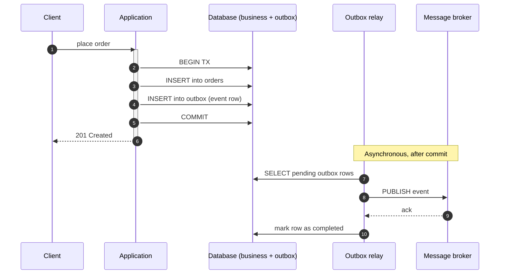
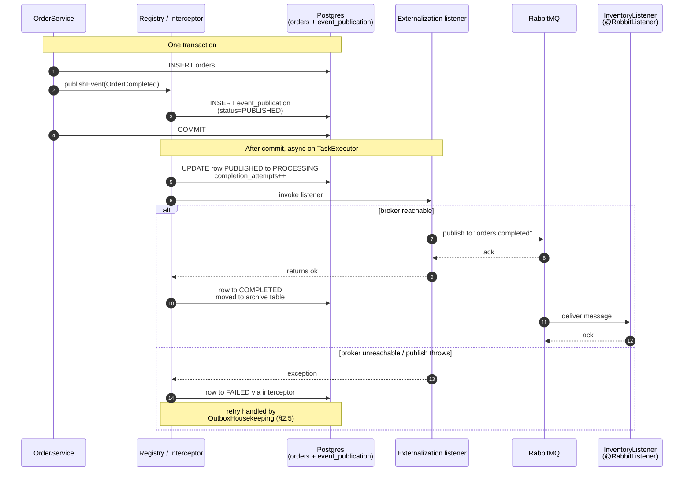
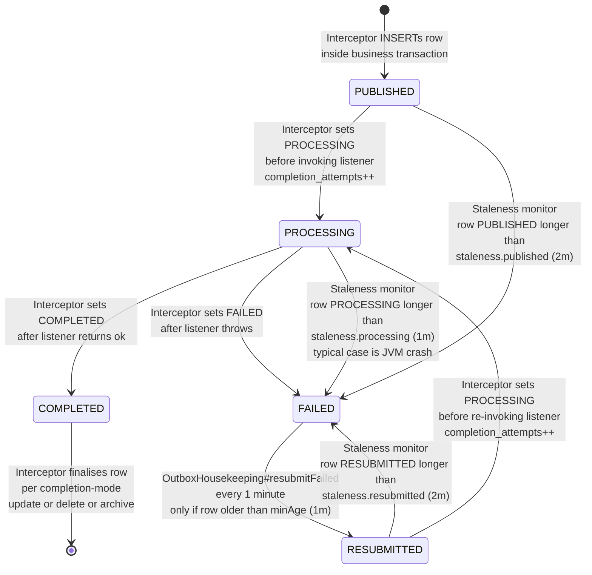
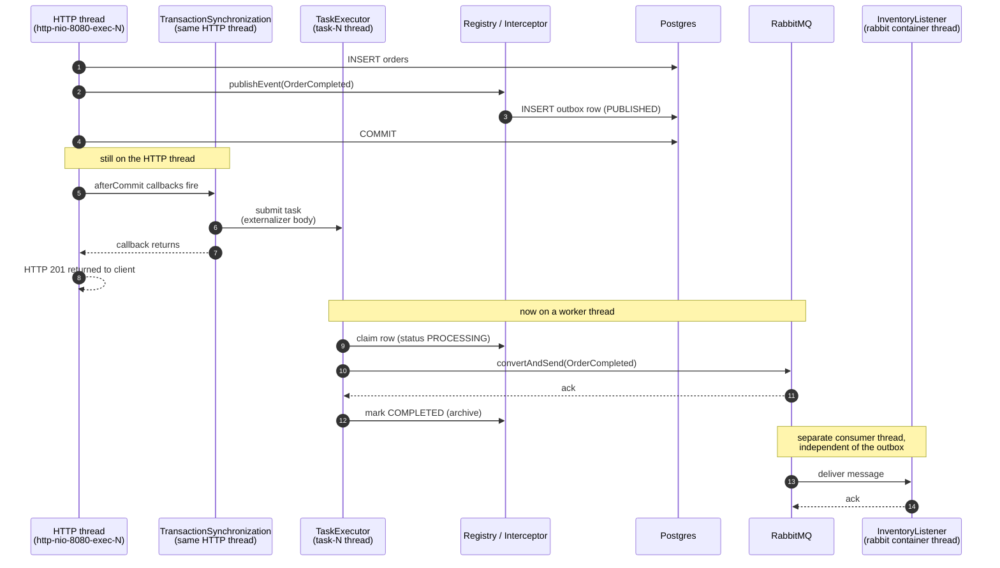
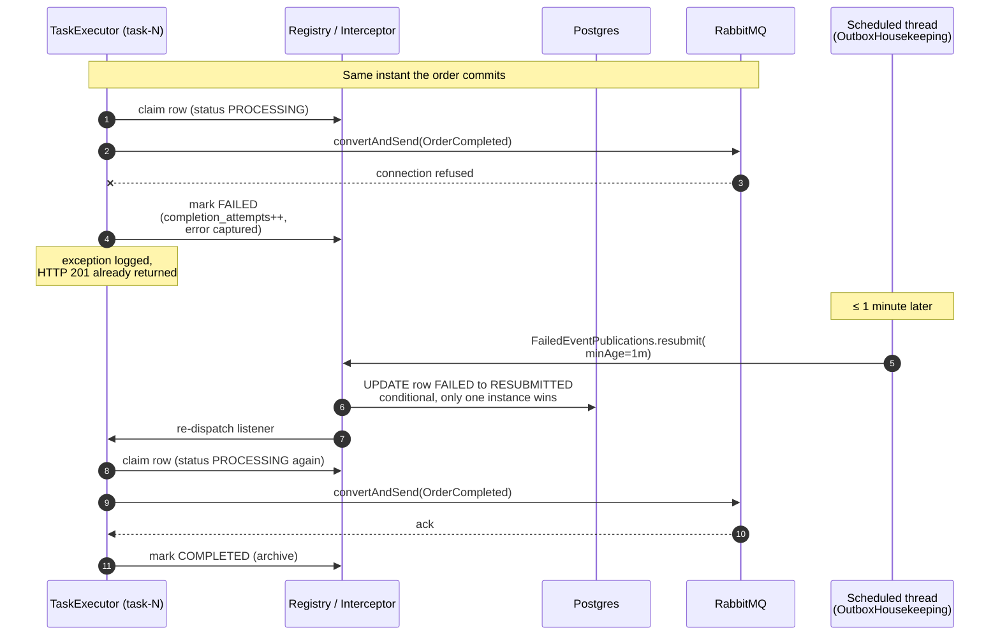
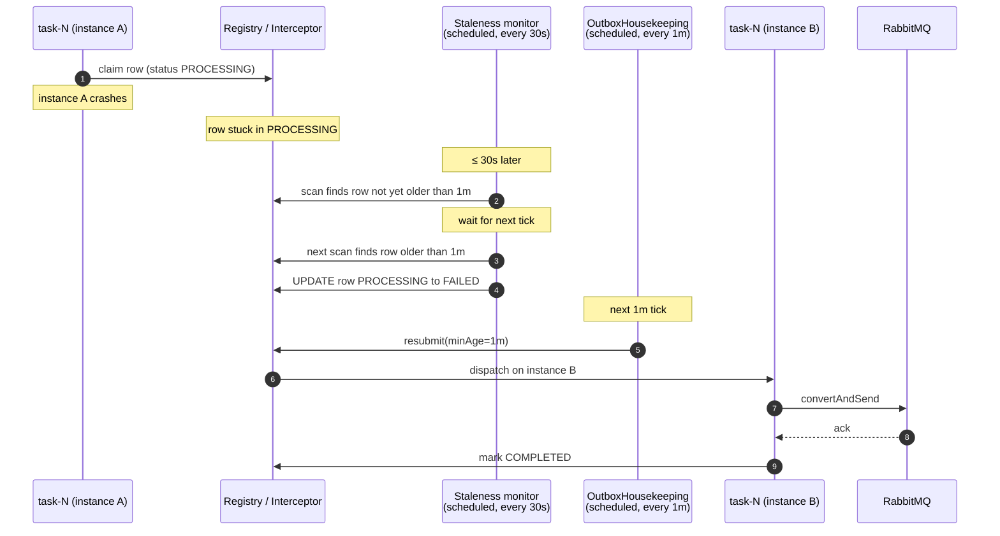
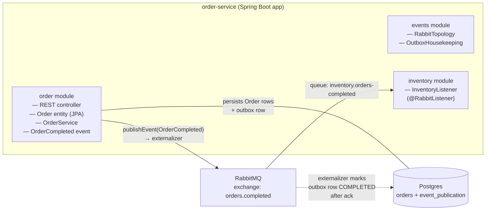

# Spring Modulith Outbox

A concrete walkthrough of the transactional outbox pattern as implemented by Spring Modulith
2.0, illustrated against this repository.

## 1. Why the outbox pattern exists

A typical "do work, then publish a message" service looks like:

```java
@Transactional
public void place(...) {
    orderRepo.save(order);                      // (1) database write
    rabbitTemplate.convertAndSend("orders", ev); // (2) broker write
}
```

This is a **dual write** — two independent systems updated in one logical operation. There is no
distributed transaction protecting them, so any of these can happen:

- (1) commits, (2) fails → the order exists, but the broker never hears about it. Downstream
  services (inventory, billing, fulfilment) silently fall out of sync.
- (1) is rolled back after (2) was sent → the broker carries an event for an order that does not
  exist.
- The process crashes between (1) and (2).

The **transactional outbox pattern** fixes this by writing the message into the same database,
in the same transaction, as the business state change. A separate process then reads from that
"outbox" table and forwards messages to the broker, marking them as sent. Either the business
write *and* the outbox row commit together, or neither does. There is no inconsistency window.



## 2. Spring Modulith's implementation

Spring Modulith does not call this "outbox", it calls it the **Event Publication Registry**. The
mechanics are exactly the outbox pattern, with the relay built into the same JVM as the
application.

The moving pieces:

- `EventPublicationRegistry` — internal SPI that writes one row to the outbox per
  transactional listener at publication time, transitions it to `PROCESSING` immediately
  before the listener runs, and finalises it to `COMPLETED` or `FAILED` based on the
  outcome.
- `EventPublicationRepository` — pluggable storage. This project uses the JDBC adapter
  (`spring-modulith-events-jdbc`); JPA, MongoDB, and Neo4j adapters also exist.
- `EventSerializer` — pluggable serialization of the event payload. Default is Jackson JSON.
- `@ApplicationModuleListener` — Modulith's shortcut for in-JVM transactional listeners
  (`@Async` + `@TransactionalEventListener(AFTER_COMMIT)` + `@Transactional(REQUIRES_NEW)`).
  This project does not currently use it — `OrderCompleted` has only the externalization
  listener as its in-JVM subscriber. Adding one would create a second outbox row per event,
  tracked independently of the externalizer.
- `@Externalized` — marks an event type for forwarding to an external broker. Spring Modulith
  registers a synthetic transactional listener that does the broker publish; that listener is
  itself tracked by the outbox.

### 2.1 What happens when an event is published

`OrderCompleted` has exactly **one in-JVM subscriber** — the externalization listener that
Spring Modulith synthesises from `@Externalized` and that publishes to RabbitMQ. The actual
inventory update happens on the *consumer* side of the broker, in `InventoryListener`
(`@RabbitListener` bound to a queue on `orders.completed`). That listener is across the broker
boundary; it is not tracked by the order-service's outbox.



The two key invariants:

- **The outbox INSERT is part of the business transaction.** If the transaction rolls back, no
  outbox row exists; nothing leaks downstream.
- **The outbox row is owned end-to-end by Spring Modulith's interceptor**, not by application
  code. Application code (`OrderService`, `Externalization listener`'s body) never reads or
  writes `event_publication` directly. The interceptor sets `PROCESSING` immediately before
  invoking the listener, and sets `COMPLETED` (success path) or `FAILED` (exception path)
  immediately after. That's the single point where success and failure are recorded — there is
  no other path that mutates row status during normal operation.

> **Why only one outbox row?** Each *transactional listener* of the in-JVM event gets its own
> row. In this project the only such listener is the externalizer. `InventoryListener` is a
> RabbitMQ consumer, not a Spring transactional event listener, so it doesn't appear in
> `event_publication` at all — its delivery is RabbitMQ's responsibility. If you added a second
> in-JVM `@ApplicationModuleListener` for `OrderCompleted`, you would see a second row, and
> the two would succeed or fail independently.

### 2.2 Publication lifecycle (Spring Modulith 2.0)



Three actors drive the transitions, on three different cadences:

| Actor | Cadence | Sets which transitions |
|---|---|---|
| **Interceptor** (`CompletionRegisteringAdvisor` in Modulith, wraps every transactional listener) | synchronous around each listener invocation | INSERT to `PUBLISHED`, `PUBLISHED` to `PROCESSING`, `PROCESSING` to `COMPLETED` or `FAILED`, `RESUBMITTED` to `PROCESSING`, finalisation on completion |
| **Staleness monitor** (built into Modulith, registered when any staleness duration is non-zero) | scheduled, `staleness.check-interval` (30s here) | `PUBLISHED` to `FAILED`, `PROCESSING` to `FAILED`, `RESUBMITTED` to `FAILED` — but only when the row has been in that state longer than the matching threshold |
| **`OutboxHousekeeping#resubmitFailed`** (your code) | scheduled, `@Scheduled(fixedDelayString = "PT1M")` | `FAILED` to `RESUBMITTED`, with `ResubmissionOptions.minAge=1m` filtering out very-recent failures |

Each row tracks `status`, `completion_attempts`, `last_resubmission_date`, plus the original
publication date and serialized event. The staleness monitor is a scheduled task (default off,
enabled by setting any of the three staleness durations) that flips rows stuck in `PUBLISHED`,
`PROCESSING`, or `RESUBMITTED` to `FAILED` so they can be resubmitted. **Spring Modulith does
not retry failed listeners on its own** — your application code calls
`FailedEventPublications.resubmit(...)` on a schedule (this project does, in `OutboxHousekeeping`).

### 2.3 Completion modes

The `spring.modulith.events.completion-mode` property decides what happens to a row after the
listener succeeds:

| Mode      | Effect                                                                                               | Trade-off                                                |
|-----------|------------------------------------------------------------------------------------------------------|----------------------------------------------------------|
| `update`  | Set `completion_date` on the existing row.                                                           | Active outbox table grows unbounded; needs periodic purge|
| `delete`  | Delete the row.                                                                                      | No audit trail of what was published                     |
| `archive` | Move the row to `event_publication_archive` (same schema), with `completion_date` set.               | Audit trail preserved, active table stays small          |

This project uses `archive` and a scheduled job purges the archive after 7 days.

### 2.4 Externalization to a broker

Externalization is a synthetic listener provided by `spring-modulith-events-amqp`/`-kafka`/`-jms`
modules. It looks for events annotated with `@Externalized` and publishes them. The annotation
value uses a `target::routingKey` syntax with SpEL:

```java
@Externalized("orders.completed::#{#this.orderId()}")
public record OrderCompleted(...) { }
```

For AMQP, `target` is the exchange name and `routingKey` is the AMQP routing key. Spring
Modulith publishes via `RabbitTemplate`; a `Jackson2JsonMessageConverter` bean (from
`RabbitTopology` in this project) makes it serialize the event as JSON.

From the registry's point of view the externalization listener is no different from any other
transactional event listener. Its outbox row is only marked `COMPLETED` after the broker has
acknowledged the message. If RabbitMQ is unreachable or the publish throws, the row is left in
`FAILED` and is resubmitted by `OutboxHousekeeping`. If you added an `@ApplicationModuleListener`
in the same JVM, it would get its own row and would succeed or fail completely independently of
the externalizer.

### 2.5 Dispatch model: not a polling outbox

The classical outbox pattern uses a separate poller that scans the outbox table on a timer
and pushes rows to the broker. Spring Modulith does **not** do that. The dispatcher is a
Spring transaction-synchronization callback that fires the moment the publishing transaction
commits. There is no scheduled task in the happy path.

#### Threads involved in a single `POST /orders`



Two key facts from this picture:

- **The HTTP thread does not wait for Rabbit.** Once the database commits, the listener is
  scheduled on the executor and the HTTP response goes out. Total latency for the client is
  business commit + a few microseconds of synchronization machinery.
- **`@Async` ≠ scheduled.** The annotation just routes the listener body to a `TaskExecutor`
  thread. The decision to invoke is still made synchronously at commit time. There is no
  timer waking up periodically to look for new rows.

#### What happens when the broker call fails



And the **stuck-listener** case — the JVM died between `PROCESSING` and the row update:



#### Schedule summary for this project

| What | Frequency | Source | What it does |
|---|---|---|---|
| Externalization for new events | none — fired at commit | Spring transaction sync | Submits the listener task immediately after commit |
| Staleness monitor | every 30s | `spring.modulith.events.staleness.check-interval` | Flips stuck `PUBLISHED`/`PROCESSING`/`RESUBMITTED` rows to `FAILED` |
| `OutboxHousekeeping#resubmitFailed` | every 1m | `@Scheduled(fixedDelayString = "PT1M")` | Picks `FAILED` rows older than 1m and resubmits them |
| `OutboxHousekeeping#purgeArchive` | every 1h | `@Scheduled(fixedDelayString = "PT1H")` | Deletes `event_publication_archive` rows older than 7 days |

So a freshly-published `OrderCompleted` reaches Rabbit on the executor thread within
milliseconds of commit; a previously-failed publication is retried on the next 1-minute tick
of `OutboxHousekeeping`; a publication stuck in `PROCESSING` because the JVM crashed needs
the staleness monitor to flip it to `FAILED` first, then the next `OutboxHousekeeping` tick
picks it up — worst case roughly 30s + 1m from the crash to the retry attempt.

## 3. This project's modules

Spring Modulith treats each top-level subpackage of the `@Modulithic` application class as an
application module.



| Module      | Package                                            | Role                                                       |
|-------------|----------------------------------------------------|------------------------------------------------------------|
| `order`     | `com.example.orderservice.order`                   | Aggregate, repository, REST endpoint, `OrderCompleted` event |
| `events`    | `com.example.orderservice.events`                  | RabbitMQ topology + outbox housekeeping                    |
| `inventory` | `com.example.orderservice.inventory`               | RabbitMQ consumer that reacts to `OrderCompleted` messages |

The `inventory` module never references `Order`, only the `OrderCompleted` event record (used
to deserialize incoming AMQP messages). In a real system this module would live in a separate
`inventory-service` application with its own database; it sits in the same JVM here purely so
the demo runs as a single Compose stack.

## 4. Configuration in this project

From `application.yaml`:

```yaml
spring:
  modulith:
    events:
      jdbc:
        schema-initialization:
          enabled: true              # auto-create event_publication[_archive]
      completion-mode: archive       # see §2.3
      republish-outstanding-events-on-restart: false
      staleness:
        published: PT2M              # mark stuck PUBLISHED rows FAILED after 2 minutes
        processing: PT1M
        resubmitted: PT2M
        check-interval: PT30S
```

`republish-outstanding-events-on-restart: false` is deliberate. The Modulith reference manual
warns that turning it on is unsafe in multi-instance deployments because peer instances may
still be processing those events. We rely on the deterministic `OutboxHousekeeping` job
(`@Scheduled(fixedDelayString = "PT1M")` calling `FailedEventPublications.resubmit(...)`) for
recovery instead.

## 5. Operational mental model

A useful sanity-check whenever you reason about an outbox failure:

1. **Did the business transaction commit?** Look for the `Order` row. If absent, the entire
   thing rolled back; no outbox rows exist; no listener was invoked. Nothing to recover.
2. **Are there rows in `event_publication`?** That's the in-flight set: pending publication or
   currently being processed.
3. **Are there rows in `event_publication` with `status = FAILED`?** Those are dead-lettered.
   `OutboxHousekeeping#resubmitFailed` will pick them up on its next tick (every minute), or you
   can call `FailedEventPublications.resubmit(...)` from your own admin endpoint.
4. **Are listener invocations stuck?** The staleness monitor will mark them `FAILED` after the
   configured durations.
5. **Are completed rows piling up?** With `completion-mode: archive`, they live in
   `event_publication_archive`. `OutboxHousekeeping#purgeArchive` deletes anything older than 7
   days hourly.

## 6. Limitations to be aware of

- **Single-database scope.** The outbox lives in the application's own database. The pattern
  protects "business write + event" atomicity but does nothing for cross-service consistency
  beyond at-least-once event delivery.
- **At-least-once, not exactly-once.** A successful broker publish followed by a crash before
  the registry can mark the row complete will replay the event. Consumers must be idempotent.
- **No automatic retry of failed listeners.** You must schedule resubmission yourself
  (this project does, in `OutboxHousekeeping`).
- **`republish-outstanding-events-on-restart`** is a footgun in multi-instance deployments;
  prefer the staleness monitor + scheduled resubmission.
- **Active table growth.** The `event_publication` table is on the hot path of every business
  transaction. Pick `delete` or `archive` completion mode and purge regularly so the active
  set stays small and indexes remain effective.

## 7. References

- Reference manual, "Working with Application Events" — <https://docs.spring.io/spring-modulith/reference/events.html>
- Reference manual appendix, configuration properties and DDL — <https://docs.spring.io/spring-modulith/reference/appendix.html>
- "Simplified Event Externalization with Spring Modulith" (blog) — <https://spring.io/blog/2023/09/22/simplified-event-externalization-with-spring-modulith>
- Kafka externalization sample — <https://github.com/spring-projects/spring-modulith/tree/main/spring-modulith-examples/spring-modulith-example-kafka>
